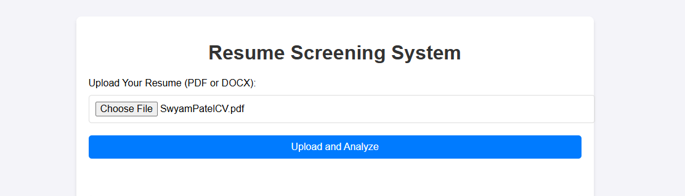
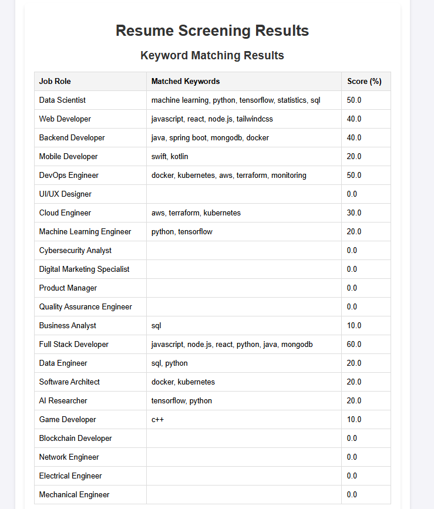
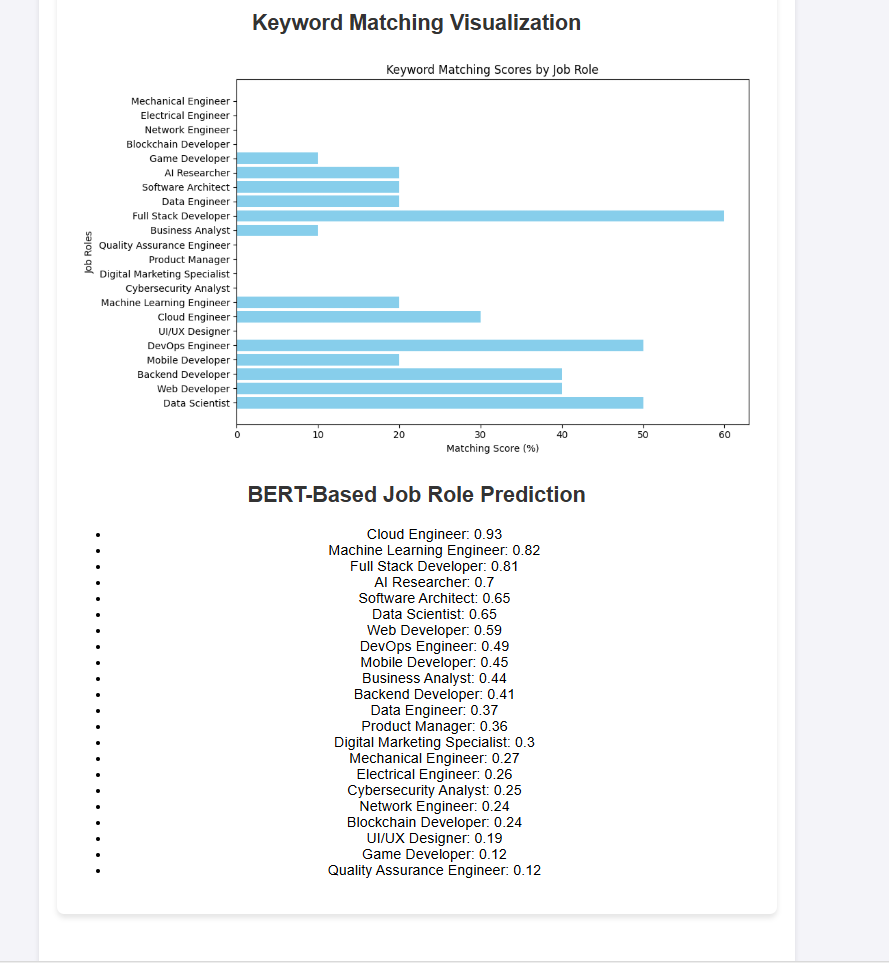

# Automated Resume Screening with NLP and Machine Learning

This project is an AI-powered Resume Screening application designed to help recruiters efficiently analyze resumes against multiple job roles. The app uses a combination of **keyword matching** and **BERT-based zero-shot classification** to evaluate resumes and match them with the most relevant job roles.

---

## Features
- **Upload Resumes**: Supports `.pdf` and `.docx` files.
- **Keyword Matching**: Matches keywords in the resume with predefined keywords for various job roles.
- **BERT-Based Classification**: Uses `facebook/bart-large-mnli` for multi-class job role prediction.
- **Visualization**: Displays keyword matching scores as bar charts for clarity.
- **Dynamic Roles**: Easily add or modify job roles and keywords in the `job_roles.json` file.
---

## What I Learned

### **Technical Skills**
- **Natural Language Processing**: Applied keyword matching and BERT-based classification for context-aware resume analysis.
- **Data Visualization**: Used Matplotlib to generate dynamic bar charts for showcasing matching scores.
- **Web Development**: Built a user-friendly Flask app with a clean frontend using HTML and CSS.
- **File Handling**: Implemented functionality to extract text from `.pdf` and `.docx` formats.

### **Problem Solving**
- Learned to integrate multiple ML models (keyword matching and BERT) to solve a real-world problem.
- Tackled challenges in text processing, including handling different file formats.

### **Collaboration Ready**
- Designed the system to be easily extendable, allowing future developers to:
  - Add new job roles and keywords dynamically.
  - Enhance analysis methods with additional NLP techniques or ML models.

---

## App Workflow
1. **Step 1**: Upload your resume in `.pdf` or `.docx` format.
2. **Step 2**: The app extracts the text, analyzes it, and matches it against job roles.
3. **Step 3**: View keyword matching results, scores, and BERT-based job role predictions.

---

## How the App Looks

### **Upload Resume**


### **View Analysis Results**


### **Visualization of Matching Scores**


---

## How to Use the Application
1. Clone the repository:
   ```bash
   git clone https://github.com/Swyampatel/automated-resume-screening.git
   cd automated_resume_screening
   ```

2. Create a virtual environment:
   ```bash
   python -m venv venv
   source venv/bin/activate  # For Linux/Mac
   .\venv\Scripts\activate   # For Windows
   ```

3. Install dependencies:
   ```bash
   pip install -r requirements.txt
   ```

4. Run the application:
   ```bash
   python app.py
   ```

5. Access the app in your browser:
   ```
   http://127.0.0.1:5000/
   ```
---

## Future Improvements
- Add multi-file upload functionality for batch analysis.
- Include support for other file formats, such as `.txt`.
- Provide detailed feedback to candidates for improving their resumes.

---

Feel free to contribute or reach out for suggestions or enhancements!
